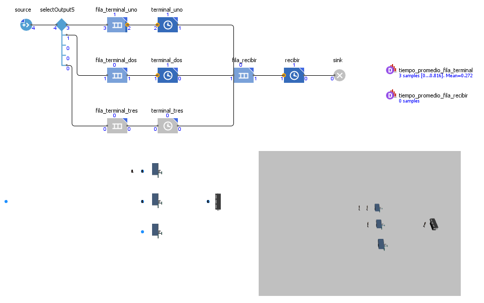
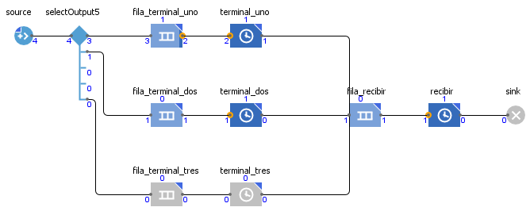
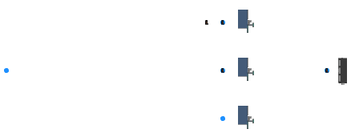
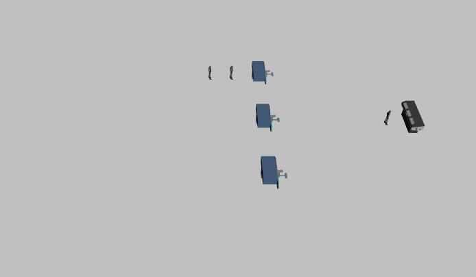
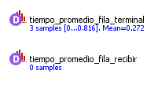

# Simulation restaurant with many terminals

A simulation in AnyLogic of a restaurant with three terminals for payment order food and later an area for recive lunch.

 

Flowchart:

 

2D animation:

 

3D animation:

 

Average queue time:

 
